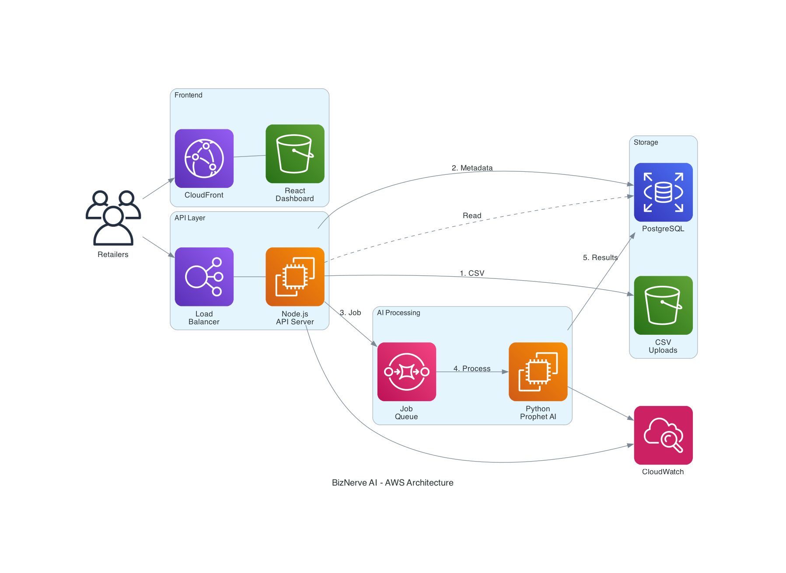

# BizNerve AI - Design Document

## Overview

BizNerve AI is an AI-powered business monitoring system for retail stores. It detects inventory risks, revenue drops, and margin issues, and provides actionable alerts through a simple dashboard.

The prototype focuses on delivering core AI-powered risk detection that helps retailers prevent losses before they happen.

**Target Users**: Small to medium retailers with 100-10,000 SKUs
**Key Value**: Predictive business assistant powered by AI demand forecasting

---

## What We Will Build (Prototype MVP)

### 1. AI-Powered Demand Forecasting (CORE AI FEATURE)

**30-Day Sales Prediction with Prophet**
- Predict sales for next 30 days per SKU using Prophet (Facebook's time series model)
- Prophet automatically handles:
  - Seasonality (weekly, monthly, yearly patterns)
  - Trend detection (growth or decline)
  - Holiday effects
  - Missing data
- Provide confidence intervals for predictions
- Update forecasts daily as new data arrives

**Smart Reorder Recommendations**
- Calculate optimal reorder quantity based on:
  - Predicted demand for next 30 days (from Prophet)
  - Current stock levels
  - Supplier lead time (configurable per supplier)
  - Safety stock buffer (20% of predicted demand)
- Suggest exact reorder timing and quantity
- Prevent stock-outs before they happen

**Seasonal Spike Detection**
- Prophet identifies seasonal patterns automatically
- Predict upcoming high-demand periods
- Alert retailers to stock up before peak seasons

**Implementation**:
```typescript
interface DemandForecast {
  sku: string
  forecastPeriod: number  // 30 days
  predictedDailySales: number[]
  confidenceInterval: {
    lower: number[]
    upper: number[]
  }
  seasonalFactors: number[]
  trendDirection: 'INCREASING' | 'STABLE' | 'DECREASING'
}

interface SmartReorderRecommendation {
  sku: string
  currentStock: number
  predictedDemand30Days: number
  recommendedOrderQuantity: number
  optimalOrderDate: Date
  reasoning: string
  estimatedStockOutDate: Date | null
}

// AI Model: Prophet (Facebook) ONLY
// Why Prophet?
// - Handles seasonality automatically
// - Robust to missing data
// - Provides confidence intervals
// - Easy to implement and explain
```

**Value Proposition**: Transforms system from reactive alerts to predictive business assistant

### 2. Simple Anomaly Detection (Z-Score Based - Inventory Only)

**Statistical Baseline Learning**
- Calculate rolling 30-day mean and standard deviation for each SKU
- Build dynamic baseline from historical sales patterns
- Used for inventory velocity calculations only
- No daily revenue alerts

**Z-Score Based Detection for Inventory**
- Detect unusual sales velocity changes for inventory planning
- Flag anomalies when |Z-score| > 2 (95% confidence level)
- Helps identify sudden demand spikes or drops affecting stock levels
- Not used for daily revenue monitoring

**Implementation**:
```typescript
interface InventoryAnomalyDetection {
  sku: string
  expectedDailySales: number  // 30-day rolling mean
  actualDailySales: number
  zScore: number  // (actual - mean) / stdDev
  isAnomaly: boolean  // |zScore| > 2
  anomalyType: 'SPIKE' | 'DROP' | 'NORMAL'
  impactOnInventory: string  // How this affects stock planning
}

// Simple Z-Score Formula:
// zScore = (actualSales - rollingMean) / rollingStdDev
// 
// if zScore < -2 → DROP anomaly (sales unusually low - may have excess stock)
// if zScore > 2 → SPIKE anomaly (sales unusually high - may need more stock)
// else → NORMAL
//
// Use Case: Inventory planning and stock-out prevention
// NOT used for: Daily revenue alerts or business performance monitoring
//
// Why Z-score for inventory?
// - Simple, explainable, fast
// - No training required
// - Helps adjust reorder quantities for unusual demand patterns
```

**Value Proposition**: Better inventory planning without alert noise

### 3. AI-Enhanced Inventory Risk Detection

**Stock-out Risk Detection (Prophet-Powered)**
- Uses Prophet demand forecasts instead of simple historical average
- Predicts stock-out dates with higher accuracy
- Accounts for upcoming seasonal changes
- Provides confidence-based risk scores

**Implementation**:
```typescript
interface AIStockOutDetection {
  sku: string
  currentStock: number
  predictedDailyDemand: number[]  // From Prophet forecast
  daysUntilStockOut: number
  riskLevel: 'HIGH' | 'MEDIUM' | 'LOW'
  recommendedAction: string
}

// Logic:
// 1. Get Prophet forecast for next 30 days
// 2. Simulate day-by-day stock depletion
// 3. Find day when stock reaches zero
// 
// if stock runs out within 7 days → HIGH risk
// if stock runs out within 14 days → MEDIUM risk
// else → LOW risk
```

**Dead Stock Detection**
- Identify products with no sales in 30+ days
- Enhanced with Prophet forecast to distinguish "dead" vs "seasonal slow"
- Calculate inventory value at risk

**Implementation**:
```typescript
interface DeadStockDetection {
  sku: string
  daysSinceLastSale: number
  currentStock: number
  inventoryValue: number
  futureOutlook: 'DEAD' | 'SEASONAL_SLOW'  // From Prophet
  recommendedAction: 'DISCOUNT' | 'PROMOTE' | 'CLEARANCE'
}

// Logic:
// if daysSinceLastSale >= 30:
//   Check Prophet forecast for next 30 days
//   if predicted sales > 0 → SEASONAL_SLOW
//   else → DEAD
```

### 4. Revenue Risk Detection (Strategic Forecasting)

**Mid-Month Revenue Projection**
- Run revenue projection checks on Day 10 and Day 20 of each month
- Use Prophet to forecast total month-end revenue based on current data
- Compare forecasted revenue against monthly target
- Alert only if significant gap detected (20-30% below target)

**Strategic Alert Triggers**
- No daily fluctuation monitoring
- No micro Z-score alerts
- Only trigger alerts for meaningful business impact
- Focus on month-end revenue achievement

**Root Cause Analysis**
- Identify underperforming categories
- Show which SKUs are dropping
- Compare current month vs last month performance
- Simple aggregation-based breakdown (no heavy AI)

**Actionable Recommendations**
- Promote top SKUs in weak categories
- Offer discounts on slow-moving products
- Review supplier costs if margin also declining
- 1-2 clear action items per alert

**Implementation**:
```typescript
interface RevenueProjection {
  currentMonth: string
  daysElapsed: number  // 10 or 20
  actualRevenueToDate: number
  projectedMonthEndRevenue: number  // From Prophet forecast
  monthlyTarget: number
  projectionGap: number  // Percentage below target
  lastMonthRevenue: number
  shouldAlert: boolean  // true if gap > 20-30%
}

interface RevenueRiskAlert {
  month: string
  checkDay: number  // 10 or 20
  projectedRevenue: number
  targetRevenue: number
  gapPercentage: number
  riskLevel: 'HIGH' | 'MEDIUM'
  rootCause: {
    underperformingCategories: CategoryBreakdown[]
    droppingSKUs: SKUPerformance[]
    vsLastMonth: ComparisonMetrics
  }
  recommendations: string[]  // 1-2 action items
}

interface CategoryBreakdown {
  category: string
  currentRevenue: number
  expectedRevenue: number
  gap: number
  topSKUs: string[]
}

// Logic:
// Day 10 Check:
// - Use first 10 days of sales data
// - Prophet forecasts remaining 20 days
// - Calculate projected month-end total
// - if (projectedRevenue < target * 0.7) → HIGH risk alert
// - if (projectedRevenue < target * 0.8) → MEDIUM risk alert
//
// Day 20 Check:
// - Use first 20 days of sales data
// - Prophet forecasts remaining 10 days
// - More accurate projection
// - Same threshold logic
//
// Root Cause:
// - Group sales by category
// - Compare current vs expected (from last month pattern)
// - Identify top 3 underperforming categories
// - List top 5 dropping SKUs
//
// Recommendations:
// - If category X down → "Promote top 3 SKUs in [category]"
// - If slow-moving inventory → "Offer 10-15% discount on [SKUs]"
// - If margin also down → "Review supplier costs for [products]"
```

**Value Proposition**: Strategic, business-aligned revenue monitoring without alert spam

### 5. Margin Risk Detection (Monthly Comparison)

**Simple Margin Tracking**
- Monitor profit margins at product and category level
- Compare current month's average margin against previous month's average margin
- Detect margin drops of 10% or more month-over-month
- Identify contributing factors (cost increase, price decrease)
- Suggest supplier review or price adjustment

**Implementation**:
```typescript
interface MarginRiskDetection {
  sku: string
  currentMonthMargin: number
  previousMonthMargin: number
  marginChange: number
  riskLevel: 'HIGH' | 'MEDIUM' | 'LOW'
  contributingFactor: 'COST_INCREASE' | 'PRICE_DECREASE' | 'BOTH'
  recommendedAction: string
}

// Logic:
// margin = ((sellingPrice - costPrice) / sellingPrice) * 100
// currentMonthMargin = average margin for current month
// previousMonthMargin = average margin for previous month
// marginChange = currentMonthMargin - previousMonthMargin
// 
// if marginChange <= -10% → MEDIUM risk
// Recommend: "Review supplier pricing" or "Adjust selling price"
```

### 6. Risk Prioritization Engine

**Alert Ranking System**
- Prioritize all detected risks by financial impact
- Calculate potential loss for each risk
- Rank alerts: HIGH → MEDIUM → LOW
- Display top 5 priority actions on dashboard

**Implementation**:
```typescript
interface PrioritizedAlert {
  id: string
  type: 'INVENTORY' | 'REVENUE' | 'MARGIN'
  severity: 'HIGH' | 'MEDIUM' | 'LOW'
  affectedSKUs: string[]
  estimatedImpact: number  // Potential loss in currency
  recommendedAction: string
  urgency: number  // Days until impact
}

// Prioritization Logic:
// score = estimatedImpact * (1 / urgency)
// Sort alerts by score (descending)
```

### 7. Alert Dashboard

**Dashboard Features**
- Display prioritized list of risks
- Color-coded severity indicators (Red/Yellow/Green)
- Show specific SKUs affected
- Provide one-line recommended actions
- Display 30-day demand forecast charts
- Drill-down view for detailed analysis

**Dashboard Layout**:
```
┌─────────────────────────────────────────────┐
│  BizNerve AI - Daily Risk Dashboard         │
├─────────────────────────────────────────────┤
│  🔴 HIGH PRIORITY (3)                       │
│  ├─ Stock-out risk: Blue Denim Shirt       │
│  │   Predicted stock-out in 5 days         │
│  │   Action: Reorder 50 units immediately  │
│  ├─ Revenue Risk: Projected 35% below      │
│  │   monthly target                         │
│  │   Action: Promote top 3 SKUs in Women's │
│  └─ Margin decline: Yellow T-Shirt         │
│      Action: Review supplier pricing       │
├─────────────────────────────────────────────┤
│  🟡 MEDIUM PRIORITY (2)                     │
│  🟢 LOW PRIORITY (1)                        │
├─────────────────────────────────────────────┤
│  📊 AI Insights                             │
│  └─ 30-day demand forecast available       │
└─────────────────────────────────────────────┘
```

### 8. Data Input & Processing

**Data Requirements**
- Sales transactions (SKU, quantity, price, date, channel)
- Inventory snapshots (SKU, current stock, cost price, selling price)
- Product catalog (SKU, name, category, supplier)

**Input Methods**:
- CSV file upload (primary for prototype)
- REST API endpoints (for future integrations)

**Processing Schedule**:
- On-demand analysis (when data uploaded)
- Daily scheduled run (midnight)
- Prophet model training: Once per week
- Processing time: Designed to process 10,000 SKUs in < 5 minutes

### 9. Core API Endpoints

```typescript
// Data Ingestion
POST /api/data/sales          // Upload sales data
POST /api/data/inventory      // Upload inventory data
POST /api/data/products       // Upload product catalog

// AI Forecasting
GET  /api/forecast/:sku       // Get 30-day demand forecast
GET  /api/forecast/reorder    // Get smart reorder recommendations
POST /api/forecast/train      // Trigger Prophet model training

// Risk Analysis
POST /api/analyze/run         // Trigger analysis
GET  /api/analyze/status      // Check analysis status

// Alerts & Dashboard
GET  /api/alerts              // Get all alerts
GET  /api/alerts/priority     // Get top 5 priority alerts
GET  /api/alerts/:id          // Get alert details

// SKU Details
GET  /api/sku/:sku/health     // Get SKU health metrics
GET  /api/sku/:sku/history    // Get SKU sales history
GET  /api/sku/:sku/forecast   // Get SKU demand forecast
```

### 10. Database Schema (Simplified)

```sql
-- Products Table
CREATE TABLE products (
  sku VARCHAR(50) PRIMARY KEY,
  name VARCHAR(255),
  category VARCHAR(100),
  supplier_id VARCHAR(50),
  cost_price DECIMAL(10,2),
  selling_price DECIMAL(10,2),
  supplier_lead_time_days INTEGER,
  created_at TIMESTAMP
);

-- Inventory Table
CREATE TABLE inventory (
  sku VARCHAR(50),
  current_stock INTEGER,
  snapshot_date DATE,
  PRIMARY KEY (sku, snapshot_date)
);

-- Sales Transactions Table
CREATE TABLE sales (
  transaction_id VARCHAR(50) PRIMARY KEY,
  sku VARCHAR(50),
  quantity INTEGER,
  unit_price DECIMAL(10,2),
  total_amount DECIMAL(10,2),
  sale_date DATE,
  channel VARCHAR(50)
);

-- Forecasts Table (Prophet outputs)
CREATE TABLE forecasts (
  sku VARCHAR(50),
  forecast_date DATE,
  predicted_sales DECIMAL(10,2),
  lower_bound DECIMAL(10,2),
  upper_bound DECIMAL(10,2),
  generated_at TIMESTAMP,
  PRIMARY KEY (sku, forecast_date)
);

-- Alerts Table
CREATE TABLE alerts (
  alert_id VARCHAR(50) PRIMARY KEY,
  alert_type VARCHAR(50),
  severity VARCHAR(20),
  sku VARCHAR(50),
  estimated_impact DECIMAL(10,2),
  recommended_action TEXT,
  created_at TIMESTAMP,
  status VARCHAR(20)
);
```

---

## High-Level Architecture

### AWS Cloud Architecture



### System Components

```
┌─────────────────────────────────────────────────────┐
│                   Frontend Layer                     │
│              React Dashboard (Web UI)                │
│         + Forecast Charts & AI Insights              │
└────────────────────┬────────────────────────────────┘
                     │
┌────────────────────▼────────────────────────────────┐
│                   API Gateway                        │
│              Express.js REST API                     │
└────────────────────┬────────────────────────────────┘
                     │
        ┌────────────┼────────────┐
        │            │            │
┌───────▼──────┐ ┌──▼──────┐ ┌──▼──────────┐
│ Data         │ │AI Engine│ │Alert        │
│ Ingestion    │ │         │ │Generator    │
│              │ │- Prophet│ │             │
│- CSV Upload  │ │  Forecast│ │- Prioritize │
│- Validation  │ │- Z-Score│ │- Format     │
│- Storage     │ │  Anomaly│ │- Display    │
│              │ │         │ │             │
└──────┬───────┘ └──┬──────┘ └──┬──────────┘
       │            │            │
       │      ┌─────▼─────┐      │
       │      │Analytics  │      │
       │      │Engine     │      │
       │      │           │      │
       │      │- Inv      │      │
       │      │  Monitor  │      │
       │      │- Revenue  │      │
       │      │  Analyzer │      │
       │      │- Margin   │      │
       │      │  Tracker  │      │
       │      │- Risk     │      │
       │      │  Engine   │      │
       │      └─────┬─────┘      │
       │            │            │
       └────────────┼────────────┘
                    │
        ┌───────────▼───────────┐
        │   PostgreSQL Database │
        │   - Products          │
        │   - Inventory         │
        │   - Sales             │
        │   - Forecasts         │
        │   - Alerts            │
        └───────────────────────┘
```

### Technology Stack

**Backend**:
- Node.js + Express.js (API server)
- Python (AI/ML models)
  - Prophet (demand forecasting) - ONLY forecasting model
  - NumPy/Pandas (Z-score calculations)
- PostgreSQL (database)

**Frontend**:
- React (dashboard UI)
- Recharts (forecast visualization)
- Tailwind CSS (styling)

**AI/ML Stack**:
- Prophet (Facebook) - Time series forecasting ONLY
- Z-score - Simple statistical anomaly detection
- No complex ML models needed

**Deployment**:
- Docker containers
- AWS EC2 / Local deployment
- Nginx (reverse proxy)

### Data Flow

1. **Data Upload**: User uploads CSV files (sales + inventory)
2. **Validation**: System validates data format and completeness
3. **Storage**: Data stored in PostgreSQL tables
4. **Prophet Training**: Train Prophet models on historical data (weekly)
5. **Forecasting**: Generate 30-day demand predictions per SKU
6. **Z-Score Calculation**: Calculate anomalies using rolling statistics
7. **Risk Analysis**: Analytics engine runs enhanced risk detection
8. **Prioritization**: Risk engine ranks alerts by impact
9. **Display**: Dashboard shows top priority actions + AI forecasts
10. **User Action**: User reviews recommendations

**Processing Time**: < 5 minutes for full analysis cycle (excluding initial Prophet training)

---

## Correctness Properties

**Property 1**: Demand forecasting - Prophet should generate 30-day predictions for all SKUs with 60+ days of historical data

**Property 2**: Smart reorder recommendations - System should suggest optimal reorder quantities based on Prophet forecasts and lead times

**Property 3**: Z-score inventory anomaly detection - System should flag SKU sales velocity with |Z-score| > 2 for inventory planning purposes

**Property 4**: Stock-out risk identification - Products with < 7 days of predicted stock (using Prophet) should be flagged as HIGH risk

**Property 5**: Dead stock detection - Products with no sales in 30+ days should be flagged, with Prophet forecast distinguishing dead vs seasonal

**Property 6**: Mid-month revenue projection - System should run revenue forecasts on Day 10 and Day 20, comparing projected month-end vs target

**Property 7**: Strategic revenue alerts - System should only alert when projected month-end revenue is 20-30%+ below target (no daily alerts)

**Property 8**: Root cause analysis - Revenue alerts should include category breakdown, dropping SKUs, and comparison vs last month

**Property 9**: Margin decline detection - Products or categories with 10%+ margin drop (current month vs previous month) should be flagged as MEDIUM risk

**Property 10**: Alert prioritization - Risks should be ranked by estimated financial impact

**Property 11**: Dashboard display - Top 5 priority actions should be displayed with color-coded severity and forecast charts

### Testing Strategy

- **Unit testing** for risk calculation logic, API endpoints, and Prophet integration
- **Property-based testing** for validation of core risk detection rules and forecast accuracy

---

## Future Roadmap (Post-Prototype)

### AI Co-Pilot Assistant
- Natural language interface for dashboard interaction
- Voice and text-based queries ("Show me products at risk of stock-out")
- Conversational insights explanation ("Why is this product flagged?")
- Guided decision-making ("What should I do about dead stock?")
- Multi-language support for diverse shop owners
- Mobile app integration for on-the-go access

### Advanced ML Forecasting
- Ensemble models combining multiple forecasting approaches
- External data integration (weather, holidays, economic indicators)
- Customer churn prediction and lifetime value analysis
- Automated hyperparameter tuning for Prophet

### Supplier Intelligence & Automation
- Supplier performance scoring and benchmarking
- Automated price comparison across suppliers
- Auto-generated purchase orders with approval workflows
- Alternative supplier recommendations based on performance
- Email/SMS alert notifications

### Multi-Channel Enterprise Features
- Real-time POS and e-commerce platform integration
- Cross-channel inventory reconciliation
- Multi-store management dashboard
- Role-based access control and team collaboration
- Advanced reporting, custom alert rules, and API marketplace
- Price optimization and elasticity modeling

---

## Success Metrics (Prototype)

**Technical Metrics**:
- Designed to process 10,000 SKUs in < 5 minutes
- Generate 30-day Prophet forecasts targeting 70-80% accuracy
- Prophet model training completes in < 10 minutes
- Target 95%+ uptime during demo period
- Dashboard load time < 2 seconds

**AI Performance Metrics**:
- Demand forecast accuracy: Targeting 70-80% within confidence interval
- Revenue projection accuracy within acceptable forecast range
- Forecast reliability aligned with Prophet confidence intervals

**Business Metrics**:
- Achieve high recall (>90%) for 7-day stock-out prediction
- Achieve high precision (>85%) for dead stock identification (30+ days)
- Maintain low false positive rate (<15%) for inventory velocity anomaly detection
- Provide actionable AI-powered recommendations for 95%+ of detected alerts

**User Experience**:
- Simple CSV upload process
- Clear, color-coded dashboard with AI insights
- Interactive 30-day demand forecast charts
- One-line action recommendations
- Drill-down details available on click
